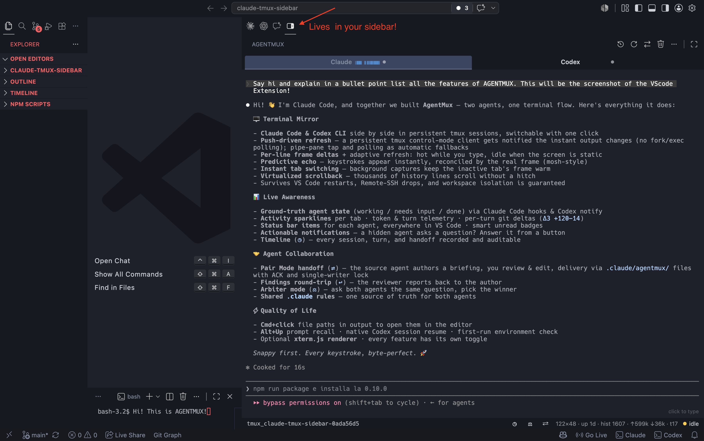

# AgentMux

**Seven agents. One terminal flow. Plus any tmux you already have.**

Run **Claude Code**, **OpenAI Codex CLI**, **OpenCode**, **Hermes** (Nous
Research), **pi** (Earendil), **Google Antigravity** (`agy`) and **Devin**
(Cognition `devin`) in persistent tmux sessions, switch between them
instantly, and hand work from one agent to another from a single VS Code
side-bar view.



The extension is deliberately workspace-scoped:

- the Claude tab controls only `tmux_claude_<folder>`;
- the Codex tab controls only `tmux_codex_<folder>`;
- the OpenCode tab controls only `tmux_opencode_<folder>`;
- the Hermes tab controls only `tmux_hermes_<folder>`;
- the pi tab controls only `tmux_pi_<folder>`;
- the Antigravity tab controls only `tmux_agy_<folder>`;
- the Devin tab controls only `tmux_devin_<folder>`;
- every existing session is accepted only when its tmux `session_path` matches
  the current VS Code workspace root;
- projects with the same folder name receive a stable path hash when needed,
  so one project can never attach to another project's tmux session.

The single exception is **free mode**, below: a tab you point at a tmux session
by name. You named it, so it is shown wherever it lives — and in exchange
AgentMux never creates, restarts, resumes over or cleans up that session.

Every agent survives VS Code restarts, Remote-SSH drops and local disconnects.

## What the view does

It mirrors the selected tmux pane instead of opening another VS Code terminal:

- a persistent tmux **control-mode client** drives everything by default: no
  fork/exec per refresh, and tmux *pushes* an output notification the moment the
  active pane changes (a `pipe-pane` tap and classic polling are automatic
  fallbacks — `claudeTmux.transport`);
- each refresh fuses the frame and its cursor/size metadata into one atomic
  call, and small changes travel to the view as **per-line deltas**;
- the refresh loop is adaptive: hot while you type or output streams, slow when
  the pane is static, watchdog-only when push notifications are live;
- one ordered input pump merges pending keystrokes under backpressure, while
  bracketed paste preserves large UTF-8 input; a precomputed byte table eliminates
  per-keystroke allocation overhead;
- hardware-accelerated GPU cursor placement (`translate3d`) and sub-pixel font
  smoothing (`-webkit-font-smoothing`) keep typing jitter-free and text razor-sharp;
- native editor selection styling (`::selection`), tactile file path hover feedback,
  glassmorphism popup overlays, and slim themed scrollbars fit natively into VS Code;
- a tab appears only while that workspace's matching tmux session exists, and
  only for agents whose CLI is installed; tabs carry live state dots with zero-cost
  GPU compositor animations;
- the `+` menu starts or resumes an absent agent (past conversations are listed
  per workspace for Claude, Codex, OpenCode, Hermes and pi);
- each tab carries its agent's colour on the underline it already had, and swaps
  its label for a two-glyph mark once the side bar is too narrow to show one;
- `Shift+Enter` breaks the line instead of submitting (each agent's encoding was
  measured in a live pane; no `~/.tmux.conf` change is needed);
- `Cmd/Ctrl+click` a `path/file.js:42` in agent output to open it in the editor;
- `Alt+Up` recalls previously submitted prompts (reconstructed locally from
  your keystrokes, never from agent output);
- mouse wheel, scrollbar and `Shift+PageUp` / `Shift+PageDown` navigate history;
  large history captures render virtualized, so scrolling up never hitches;
- new output follows automatically only while you are at the bottom;
- switching tabs recycles row elements in place, painting warm cached frames
  instantly with zero DOM recreation stutter.

## Requirements

Install these on the machine where the extension runs. Under Remote-SSH that is
normally the remote host.

```bash
tmux -V
claude --version
codex --version
opencode --version
hermes --version
pi --version
```

- tmux 2.9 or newer;
- at least one agent CLI on `PATH` — Claude Code, OpenAI Codex, OpenCode,
  Hermes (Nous Research), pi (Earendil) or Google Antigravity (`agy`) — for its
  tab.

You may use any tab when only one agent CLI is installed. A **free mode** tab
needs no CLI at all: it mirrors a tmux session you already have.

## Build and install

From this repository:

```bash
npm run check
npm run package
code --install-extension claude-tmux-sidebar-0.16.0.vsix --force
```

Alternatively use VS Code: **Extensions → … → Install from VSIX…**, select the
generated file, then run **Developer: Reload Window**.

For Remote-SSH, install the VSIX in the remote extension host from the connected
window. `tmux`, `claude` and `codex` must be available on that same remote host.

The **AgentMux** icon appears in the Activity Bar. You can drag its view to the
Secondary Side Bar; VS Code remembers the layout.

## Daily workflow

1. Open a project folder in VS Code.
2. Open **AgentMux**. If no agent is running, choose one from the central
   launcher. Use `+` later to add the others.
3. Start or resume:
   - each agent lists its own past conversations for this folder, when its CLI
     exposes them (Claude, Codex, OpenCode, Hermes, pi);
4. Click the mirror and type. Switch visible tabs whenever you want; both tmux
   sessions continue running independently.
5. Scroll with the wheel or scrollbar. Use `Shift+PageUp/PageDown` from the
   keyboard. Plain `PageUp/PageDown` are still forwarded to the agent TUI.

The toolbar actions always target the selected tab:

| Action | Result |
|---|---|
| Resume / switch | Resume the selected agent's past conversation(s) for this folder. |
| Restart | Replace only the selected workspace tmux and relaunch its agent cleanly. |
| Hand off | Open the editable Pair Mode handoff to another agent. |
| Kill | Kill only the selected agent's workspace session. |
| Manage | List this workspace's agent tmux sessions. |

## Pair Mode

Pair Mode coordinates the agents sequentially and refuses a handoff while
either side is detected as working:

1. Select the agent that currently owns the work and press `⇄`.
2. Add optional details for the other agent. Nothing is sent until you press
   **Create handoff**.
3. If the other agent has no workspace tmux, the extension offers to start it.
4. AgentMux asks the source agent to author a standalone briefing specifically
   for the target: objective, completed work, files, decisions, tests, risks and
   the recommended next action.
5. Fresh Git facts are added separately. Choose **Continue task**, **Review
   only** or **Review & Fix**, then freely edit the complete message.
6. Only **Send handoff** delivers the reviewed message. By default the briefing
   is written to `.claude/agentmux/handoff-<id>.md` and only a short pointer is
   pasted into the target TUI; the target acknowledges by writing
   `.claude/agentmux/ack-<id>` (or printing the marker line if it cannot write
   files). On success it becomes the Pair Mode writer. If the best-effort
   acknowledgement is not observed, AgentMux offers manual acceptance or
   dismissal without ever resending. A delivered handoff even survives a VS Code
   restart (rehydrated from the workspace ledger as manual-accept only).
7. After a **Review only** / **Review & Fix** handoff completes, `↩` asks the
   reviewer to author a structured findings report and hands it back to the
   original author under the same acknowledgement rules.
8. Hand back with `⇄`, release the lock with `◇`, or audit everything in the
   `◷` Timeline.

### Arbiter mode

`⚖` (or **AgentMux: Ask both agents**) sends one question to two running
agents in parallel — answers only, no file changes. Both replies are gathered
through the `.claude/agentmux` channel and shown side by side; the answer you
pick makes that agent the Pair Mode writer and tells it to proceed.

The briefing capsule now includes recent commits, capped real diff hunks, your
task file (`claudeTmux.handoffTodoFile`), optional verify-command output
(`claudeTmux.handoffVerifyCommand`, trust-gated) and best-effort conversation
resume pointers, in addition to the Git status/stat facts.

The compact footer shows pane size, session uptime and agent state — plus, when
available, token usage and turn count tailed from the CLI's own local
transcript, the current tool while working, and the last turn's git delta
(`Δ3 +120−14`). It also shows available history, attached tmux clients and
capture lag when that lag is high enough to matter. All of it reuses existing
snapshots and local file reads; nothing new runs on the live refresh path and
nothing leaves your machine.

Agent state is no longer only a heuristic: managed launches install Claude Code
lifecycle hooks, a Codex notify program and an OpenCode state plugin that stamp
`working` / `needs-input` / `done` (and the current tool) into tmux pane
options, which the extension already reads for free. A single consolidated
**status bar item** mirrors the active agent everywhere in VS Code (every
present agent in its tooltip, click to cycle focus), the view badge counts
agents that finished or are waiting, and when a hidden agent asks a numbered
question a notification offers its options as one-click answer buttons
(explicit, identity-pinned, never automatic). Anyone attached to the tmux
session from a real terminal sees the same facts on the tmux status line.

The lock coordinates input sent through this side bar; it cannot stop a turn
that was launched outside the extension or prevent a user/process attached to
the same tmux session elsewhere from editing files.
**Review only** is an instruction to the agent, not an operating-system sandbox.

## Shared `.claude` rules

With `claudeTmux.codexReadClaudeRules` enabled (the default), every Codex start,
resume and restart receives a developer instruction to recursively discover and
read all Markdown files below the workspace `.claude` directory before working.
This includes `.claude/CLAUDE.md` and any other nested `.md` files. The extension
does not copy or modify those rules, so `.claude` remains the single source of
truth for both agents.

The bridge uses Codex's per-launch `developer_instructions`. If
`claudeTmux.codexArgs` already defines that key, the bridge is skipped and the
extension warns once instead of silently replacing the explicit value. An
existing global Codex `developer_instructions` value is replaced for bridged
launches; keep durable project constraints in `.claude`, or disable the bridge
and compose the instruction yourself in `codexArgs`.

Codex is also started in **Full Access** by default. This was chosen for the
requested workflow, but it disables Codex approvals and sandboxing. Turn off
`claudeTmux.codexFullAccess` for repositories you do not fully trust.

## Driving AgentMux from a script

Four commands take arguments and return values, so AgentMux can be driven from a
keybinding, a task or another extension instead of only by hand:

| Command | Arguments | Returns |
|---|---|---|
| `claudeTmux.send` | `{ agent, text, submit }` | `{ ok, agent, reason }` |
| `claudeTmux.capture` | `{ agent, lines, quiet }` | `{ ok, agent, session, text }` |
| `claudeTmux.status` | `{ agent }` (omit for all) | `{ <agent>: { present, status, forMs, tool, title, writer } }` |
| `claudeTmux.waitFor` | `{ agent, status, timeoutMs }` | `{ ok, agent, status, reason }` |

Together they make *send → wait for done → capture* a three-line script. They
obey exactly the rules the side bar does — the workspace check, the Pair Mode
lock, the handoff freeze — and return the reason for a refusal (`not-running`,
`pair-locked`, `transaction-in-progress`) rather than swallowing it.

A keybinding example:

```jsonc
{ "key": "ctrl+alt+t", "command": "claudeTmux.send",
  "args": { "agent": "claude", "text": "run the tests and summarize failures" } }
```

## Agent CLI & MCP Bridge

AgentMux includes an embedded local IPC socket server and exposes a command-line interface and standard Model Context Protocol (MCP) server so that terminal scripts and agents themselves can inspect and drive neighboring agents across tmux panes:

### CLI (`agentmux`)

The bundled `agentmux` binary communicates with the running AgentMux instance:

```bash
# List all active agents and their status
agentmux list

# Inspect detailed status, turns, and telemetry
agentmux status codex

# Read recent terminal output lines from an agent pane
agentmux read claude --lines 50

# Prompt an agent and atomically wait for completion
agentmux prompt codex "Run pytest and verify the test suite" --wait --until done
```

### Model Context Protocol (MCP)

To let Claude Code, Codex, Cursor, or Antigravity interact with AgentMux as peers, add to your project's `.mcp.json` or global config:

```json
{
  "mcpServers": {
    "agentmux": {
      "command": "node",
      "args": ["<path-to-agentmux>/bin/agentmux-mcp.js"]
    }
  }
}
```

Exposed MCP tools: `list_agents`, `get_agent_status`, `read_agent_output`, `prompt_agent`.

## Git Worktree Isolation

When running multiple agents simultaneously on the same repository, enable `claudeTmux.worktrees: true`. Each agent will launch in its own isolated worktree (`.agentmux/worktrees/<agent>`) on branch `agent/<agent>`. Once an agent completes its feature, run `AgentMux: Merge active agent Git worktree into current branch`.

## Native Agent Presets

Add first-class agent definitions for **Aider**, **Goose**, **Cursor CLI**, and **Continue** in one click via **AgentMux: Add agent from preset…** without writing custom regex or configuration.

## Getting to the right agent

| Command | Default key | What it does |
|---|---|---|
| `claudeTmux.gotoAttention` | `Ctrl/Cmd+Shift+Alt+A` | Jump to the agent blocked on you, else the most recent completion. |
| `claudeTmux.lastAgent` | — | Toggle back to the agent you were on before. |
| `claudeTmux.nextAgent` / `prevAgent` | — | Walk the running agents. |
| `claudeTmux.jumpAgent` | — | `{ "index": 2 }` — the Nth running agent. |

Clicking the status bar item goes to the agent that wants you when there is one,
and only falls back to cycling.

## Agent integrations

With `claudeTmux.stateHooks` on (the default), a managed launch wires each agent
to report its true state instead of leaving it to screen heuristics: Claude Code
lifecycle hooks, Codex's native hooks, an OpenCode plugin and a pi extension.
Every one acts only on panes carrying `AGENTMUX=1`, so an agent you start
yourself is untouched.

**AgentMux: Agent integrations: show, install or remove…** lists all of them —
where each file lives, whether it is installed *and up to date*, and what it is
for — with install, reinstall, remove and reveal. Content is compared, so a file
left behind by an older version reads as *out of date* rather than silently
doing the wrong thing. **AgentMux: Remove agent integrations** deletes them all
in one step.

Codex is the one that needs a keypress: its hooks travel as `-c` launch
arguments (never written to your `config.toml`) and Codex asks once to trust the
command set — *"N hooks need review before they can run"*, press `t`. Until you
do, they stay inactive and Codex's `notify` program still reports `done`.

## How AgentMux reads an agent's state

An agent that reports its own lifecycle is always believed first — that is what
the integrations above are for. When there is no report, AgentMux reads the
pane, and the question is never just *does this phrase appear* but **where**.

The pane is cut into regions, and every rule names the one it is matched
against:

| Region | What it is |
| --- | --- |
| `title` | The pane title, i.e. whatever the TUI wrote with OSC 0/2. |
| `foot` | The last 5 non-blank lines: the mode/status line a TUI keeps pinned to the bottom. |
| `prompt` | The prompt box body, between the last two rule lines the TUI drew. |
| `dialog` | Everything below the last rule line. |
| `body` | The last 12 lines **minus the prompt box**. The default for needs-input rules. |
| `tail` | The last 12 non-blank lines. The default for working and hold rules. |
| `head` | The first 20 non-blank lines: first-run banners and trust prompts. |
| `screen` | The whole captured frame. |

`body` is the one that matters most in daily use. Type *"do you want to delete
the old migrations?"* at Claude and the phrase is in the tail — but it is in the
prompt box, which `body` cuts out, so the tab does not claim the agent is asking
you something when it is waiting for you.

A rule casts one of three verdicts. `needs-input` and `working` set the status;
**`hold` freezes it**. Opening Claude's transcript with Ctrl+O covers the pane
with chrome that describes itself and not the agent — before, the frame stopped
changing and the decay timer walked a working agent down to idle behind it.

Rules are evaluated by priority, highest first (title 1100, hold 1000,
needs-input 900, working 500), first match wins. An entry is one pattern, an
array of patterns that must **all** match, or an object:

```jsonc
"claudeTmux.detectionRules": {
  "claude": {
    "working": [
      { "region": "foot", "match": "esc to interrupt" },
      { "region": "body", "match": "spinning", "not": ["· done \\d"] }
    ],
    "hold": [["select model", "esc to cancel"]],
    "title": { "working": ["^⠿"] }
  }
}
```

A provided list **replaces** the built-in one, so `[]` disables a noisy rule.

### When the dot is wrong

**AgentMux: Explain the active agent's state** prints which signal won — the
hook, a rule, or decay — the regions the current frame was cut into, and what
every rule made of them: matched, missed by which pattern, vetoed by which
guard, or matched but outranked.

A misfiring rule is usually gone by the time you look, so the same report runs
offline:

```bash
tmux capture-pane -p -t '=tmux_claude_myproject:' > screen.txt
```

then **AgentMux: Explain a captured screen** against that file. It touches no
tmux state, so it works on a screen captured on another machine or pasted into a
bug report. The screens under `test/screens/` are real captures used exactly
this way by the test suite.

## Free mode: any tmux, any agent, no release

The seven built-in agents are the ones AgentMux knows how to install, resume and
introspect. **Free mode** covers everything else, through
`claudeTmux.customAgents`, so a new CLI never has to wait for a new version of
this extension. Two shapes:

```jsonc
"claudeTmux.customAgents": [
  // 1. A new agent AgentMux manages exactly like a built-in one.
  {
    "id": "aider",
    "label": "Aider",
    "command": "aider",
    "args": "--yes",
    "resume": { "latest": "aider --restore {args}" }
  },
  // 2. A tmux session YOU started, mirrored in a tab.
  { "id": "build", "label": "Build loop", "session": "my-build-loop" }
]
```

A **launch** entry (`command`) is a first-class agent: its own tmux session
(`tmux_<id>_<folder>`, override with `sessionPrefix`), presence and status,
input, handoffs, arbiter rounds, Pair Mode, preflight and cleanup. Add `pane` to
adopt an instance you started outside AgentMux, `detection` for its TUI's
prompts, `resume` templates (`{args}`, `{id}`) if its CLI can resume, `accent`
and `mark` for its tab, and `modEnter` for the bytes it reads as a newline —
`"\\x1b[13;2u"` or `"\\x1b[27;2;13~"`, the two encodings the built-in agents
use. Without one, `Shift+Enter` submits, as it did before.

A **mirror** entry (`session`) is the "free" one: the tab shows a tmux session
AgentMux did not create. It is the only tab not tied to the workspace root —
you named the session, so it is shown wherever it lives. In exchange, nothing
destructive reaches it: AgentMux never creates, restarts or resumes over it,
never offers it in bulk kill, and never lists it as a leftover to clean up.
Killing it is possible from the single **Kill** command, which states plainly
that AgentMux did not create it.

The easy path is the **＋** button at the end of the tab strip. Its menu lists
the agents you can start or resume, then below a rule:

- **Mirror a tmux session…** — pick from your running tmux sessions and AgentMux
  writes the settings entry for you.
- **Remove a custom agent…** — shown only once you have one; removes the entry
  and leaves the tmux session running.

Both are in the command palette too, as **AgentMux: Mirror an existing tmux
session (free mode)…** and **AgentMux: Remove a custom agent…**. The roster is
built once at activation, so both offer a window reload.

If the mirror list comes back empty, there is genuinely nothing to add: sessions
AgentMux already drives are filtered out, so a machine whose only tmux session
is an agent tab has nothing left to offer. Start the session you want to mirror
first, then run it again.

## Settings

The existing `claudeTmux.*` namespace is retained so upgrades keep current user
settings.

| Setting | Default | Meaning |
|---|---|---|
| `claudeTmux.refreshMs` | `120` | Mirror refresh interval in milliseconds. |
| `claudeTmux.claudeArgs` | `--dangerously-skip-permissions --ide` | Arguments used for Claude start/resume. |
| `claudeTmux.codexArgs` | `--no-alt-screen` | Arguments used for Codex start/resume; the default preserves scrollback. |
| `claudeTmux.codexFullAccess` | `true` | Add Codex's approval/sandbox bypass flag. Disable for untrusted repositories. |
| `claudeTmux.codexHooks` | `true` | Pass Codex's native lifecycle hooks at launch (working / needs input / done as ground truth). Codex asks once to trust them. Needs Codex 0.147+. |
| `claudeTmux.codexReadClaudeRules` | `true` | Tell Codex to read every Markdown file recursively under `.claude`. |
| `claudeTmux.sessionPrefix` | `tmux_claude_` | Claude session prefix. |
| `claudeTmux.codexSessionPrefix` | `tmux_codex_` | Codex session prefix. |
| `claudeTmux.opencodeSessionPrefix` | `tmux_opencode_` | OpenCode session prefix. |
| `claudeTmux.opencodeArgs` | `--auto` | Arguments passed to `opencode`. |
| `claudeTmux.hermesSessionPrefix` | `tmux_hermes_` | Hermes session prefix. |
| `claudeTmux.hermesArgs` | `--cli --yolo` | Arguments passed to `hermes`; `--cli` keeps tmux scrollback, `--tui` uses the Ink UI. |
| `claudeTmux.piSessionPrefix` | `tmux_pi_` | pi session prefix. |
| `claudeTmux.piArgs` | `""` | Arguments passed to `pi`. Empty on purpose: pi has no approval prompts to bypass. Add `-a` to auto-answer its project-trust question. |
| `claudeTmux.antigravitySessionPrefix` | `tmux_agy_` | Antigravity session prefix. |
| `claudeTmux.antigravityArgs` | `--dangerously-skip-permissions` | Arguments passed to `agy`. |
| `claudeTmux.devinSessionPrefix` | `tmux_devin_` | Devin session prefix. |
| `claudeTmux.devinArgs` | `""` | Arguments passed to `devin`. |
| `claudeTmux.customAgents` | `[]` | Free mode: extra agents declared in settings — a new CLI to manage, or an existing tmux session to mirror. |
| `claudeTmux.ansiPalette` | `theme` | `theme` remaps ANSI onto the VS Code terminal theme; `terminal` uses the classic xterm palette. |
| `claudeTmux.detectionRules` | `{}` | Per-agent detection rules (`needsInput` / `working` / `hold`, and the same under `title`) used when an agent reports no lifecycle state. See [How AgentMux reads an agent's state](#how-agentmux-reads-an-agents-state). |
| `claudeTmux.scrollbackLines` | `1000` | Captured history lines, from 0 to 5000. |
| `claudeTmux.fontFamily` | `""` | Empty inherits `terminal.integrated.fontFamily`. |
| `claudeTmux.fontSize` | `0` | Zero inherits `terminal.integrated.fontSize`. |
| `claudeTmux.cursorStyle` | `block` | `block`, `bar` or `underline`. |
| `claudeTmux.autoResume` | `false` | Optionally auto-resume the newest Claude conversation when the view opens. |
| `claudeTmux.transport` | `auto` | `auto` (control mode → pipe tap → polling), `control`, `pipe`, or `poll`. |
| `claudeTmux.fileLinks` | `true` | Cmd/Ctrl+click `file:line` tokens to open them in the editor. |
| `claudeTmux.promptHistory` | `true` | Alt+Up prompt recall (workspace-local; clear via command). |
| `claudeTmux.statusBarItems` | `true` | A single status bar item for the active agent (all present agents in its tooltip; click to cycle focus). |
| `claudeTmux.notifyPrompts` | `true` | Notification with answer buttons when a background agent asks. |
| `claudeTmux.stateHooks` | `true` | Ground-truth state via Claude hooks, Codex notify, the OpenCode plugin and the pi extension. |
| `claudeTmux.telemetry` | `true` | Token/turn/tool chips tailed from local CLI transcripts. |
| `claudeTmux.eventLog` | `true` | Timeline ledger at `.claude/agentmux/ledger.jsonl`. |
| `claudeTmux.tmuxStatusBar` | `true` | AgentMux facts on the tmux status line of agent sessions. |
| `claudeTmux.fileChannel` | `true` | Handoffs/ACKs/arbiter answers travel as `.claude/agentmux` files. |
| `claudeTmux.handoffDiffChars` | `6000` | Diff-hunk budget in briefings (0 disables). |
| `claudeTmux.handoffTodoFile` | `tasks/todo.md` | Task file included in briefings (empty disables). |
| `claudeTmux.handoffVerifyCommand` | `""` | Optional trust-gated verify command run once at draft time. |

## Scope and limits

- A workspace folder is required; the extension never falls back to `$HOME`.
- In a multi-root workspace, the first root is used.
- A free-mode **mirror** tab is the one exception to workspace scoping, by
  design; it is also the one tab AgentMux will not create, restart or clean up.
- The agent roster is assembled at activation, so a `claudeTmux.customAgents`
  edit takes effect after a window reload.
- With `stateHooks` off (or unmanaged launches), `working`, `finished` and
  `needs input` fall back to visual heuristics based on submitted input, pane
  changes and common prompts; they can occasionally be wrong.
- Codex's hooks stay inactive until you trust them once in the pane; the tab
  shows *needs input* while that prompt is up, and `notify` still reports `done`.
- A pane whose running command is an interpreter (`node`, `python`, …) is only
  recognised as an agent when its **pane title** identifies one, so an agent
  that neither names itself in the command nor sets a title — Hermes, measured —
  is not adopted unless AgentMux launched it.
- The control-mode client parks on a private `_agentmux_ctl_<pid>` session and
  rides along on the active agent session to receive push notifications; it is
  excluded from the footer's client count and cleans up after itself.
- Transcript telemetry parses the CLIs' local JSONL files, which are not a
  stable API; the chips silently disappear if a format changes.
- This is a terminal mirror, not a full PTY. Mouse input is not forwarded.
- Scrollback is bounded by `claudeTmux.scrollbackLines` and tmux's own history.
- Multi-line paste is sent raw and a newline may submit input.
- Pair Mode transfers a source-authored, target-specific snapshot and uses a
  best-effort terminal acknowledgement; it remains sequential and user-reviewed.
- A tab disappears when the agent TUI exits even if its tmux shell remains; the
  launcher can start the agent again in that workspace session.

See [USER_GUIDE.md](USER_GUIDE.md) for troubleshooting and [TESTING.md](TESTING.md)
for the installation smoke test.
